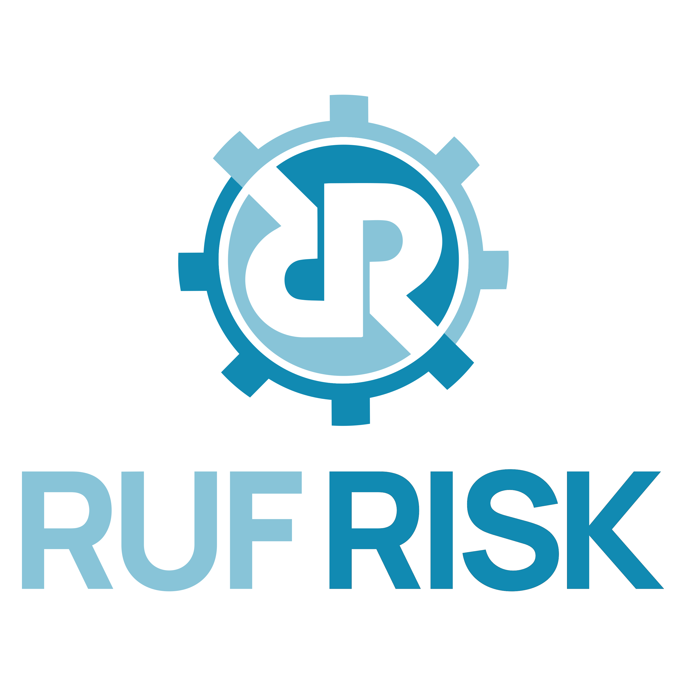

    <h1 style="border:none; ">&nbsp;OSCAL Enablement</h1>

OSCAL-enablement is an open-source Python library for validating, manipulating and converting OSCAL content.
  

# Development

This project is based on Python 3.12 and the SaxonC HE Python Library. It is designed to be included as a Python module in a larger application.

  

 
_Cybersecurity&nbsp;Automation_&nbsp;&nbsp;_OSCAL&nbsp;Enablement_ 
_Consulting_&nbsp;&nbsp;_Proposal&nbsp;Support_&nbsp;&nbsp;_Training_ 
<a href="https://RufRisk.com" style="font-style: normal;" target="_blank">https://RufRisk.com</a>

